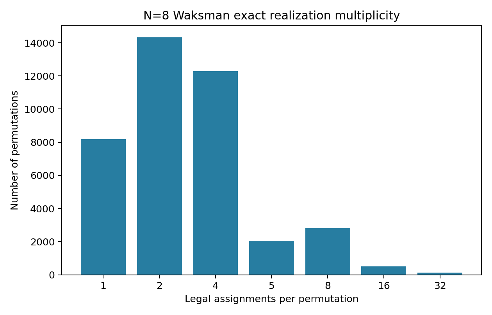
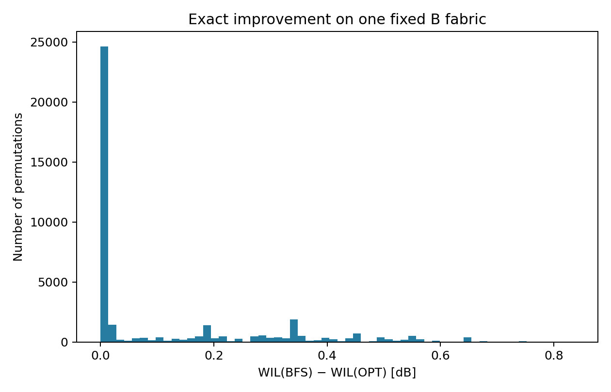
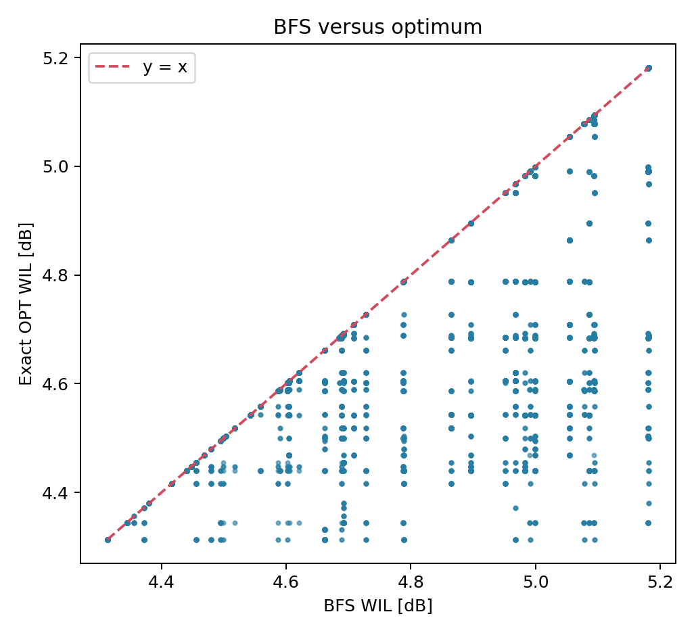
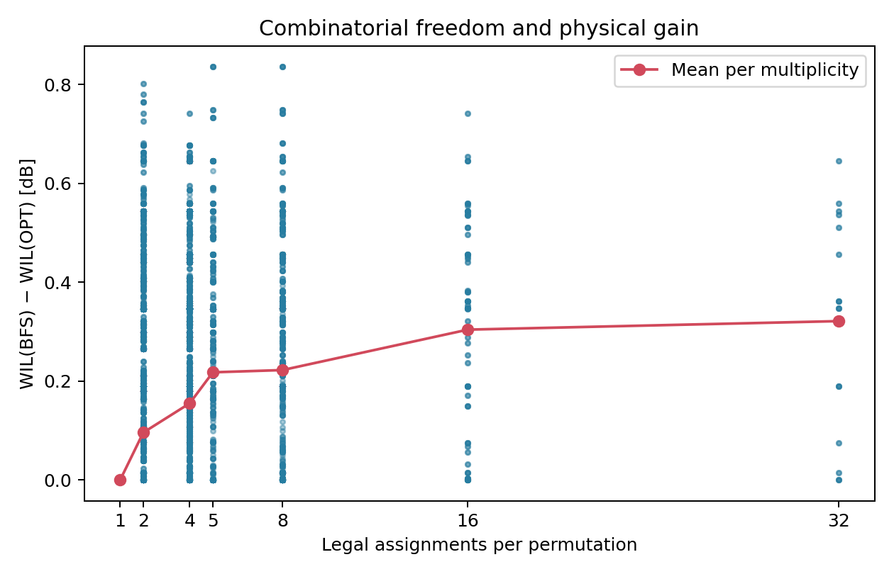

# N=8 Waksman State-Assignment Optimization Study

## 1. Experimental setup

N=8; actual MRR/SE count M=17. One current-code Waksman fabric, B_db_placeholder, fixed topology, physical port mapping, router and loss coefficients. The fabric was routed 1 time(s) in this run (cache used: False); every assignment uses geometry `5a67bc1635a61649f589fe024bb44f7be0d01b4606e60df39d053f9839b77427`. No comparison to an older geometry hash is made.

The routing call used pops_ladder=(30000,), min_crossing_clearance_um=10.0, straighten_jogs=True, physical_turn_guard=False and v4_search=False. MRR S-parameters were loaded through the existing strict library loader. The full effective routing/loss rules and protected-file hashes are saved alongside the results.

Propagation loss: 0.002 dB/µm; bend loss: 0.0 dB/bend; crossing loss: 0.0 dB/crossing. The evaluator includes both external waveguides and MRR-internal geometry.

Failed edges: 0; audits: `{'legacy_drc': 0, 'same_net_min_spacing': 5, 'perpendicular_clearance': 0, 'crossing_clearance': 0, 'bend_radius_legality': 0}`. The existing A* campaign treats same-net spacing, perpendicular clearance and crossing clearance as measurement-only. Their findings are retained; its identical admission filter is applied only to the reference evaluator's DRC metadata. Geometry and losses are unchanged. Legacy DRC and bend-radius violations are required to be zero.

Each distinct directed fabric path is evaluated once by the repository's `analysis.fabric_loss._evaluate_path_loss`, with `_loss_setup` caching edge geometry and crossings. There are 176 unique physical paths and 1,048,576 active-path lookups across all assignments. The study adds no alternative loss formula.

All ports are zero-based. The printed bit vector lists bit 0 first; its MRR order is `mrr_bit_order` in summary.json. BAR=0, CROSS=1. The official strategy is explicitly pinned to WaksmanStrategy. The task's 'BFS' label refers to its recursive parity propagation; the current implementation traverses constraints using a stack (`pop()`), which does not change this baseline definition.

## 2. Exact state-space coverage

Enumerated all 131,072 = 2^17 states exactly once using `realize_state_assignment`. Every mapping is a bijection and appears in exactly one inverse-LUT group. Realized 40,320 distinct permutations; missing permutations: 0. Coverage is 100%.

## 3. Routing multiplicity

Legal assignments per permutation: min 1, max 32, mean 3.250793651, median 2.0. 32,128 permutations (79.682540%) have multiple assignments.

| Legal assignments | Permutations |
|---:|---:|
| 1 | 8192 |
| 2 | 14336 |
| 4 | 12288 |
| 5 | 2048 |
| 8 | 2816 |
| 16 | 512 |
| 32 | 128 |

## 4. Current BFS baseline

For all 40,320 permutations, the official recursive assignment was checked both by simulation against the requested permutation and by membership in the exact inverse LUT. All checks passed. Instrumentation later reproduced each same baseline state.

## 5. Exact minimum-WIL assignment

All candidate assignments were evaluated once, grouped by their already-known permutation. Each candidate's WIL is the maximum of its eight active-path losses. The ordering is numeric WIL, total CROSS count, sum of eight insertion losses, then lexicographic state vector. The WIL comparison is strict; the tolerance used for optimality classification and counting equivalent WIL optima is 1e-10 dB. Both tolerant and strict optimum counts are exported, retaining multiple optima.

18,328 permutations have multiple minimum-WIL states within tolerance. For 0 permutations, tolerant and exact floating-point counts differ. Each optimum satisfies WIL_OPT ≤ WIL_BFS + tolerance.

## 6. BFS vs optimum

BFS is WIL-optimal for 24,338/40,320 permutations (60.362103%). It is suboptimal for 15,982 permutations.

Across all permutations, mean / median / maximum improvement is 0.112998701 / 0.000000000 / 0.835873930 dB. Conditioned on suboptimal BFS, mean improvement is 0.285077438 dB. Mean / maximum relative reduction in the numerical dB value is 2.273776% / 16.134783%, defined as 100 × ΔWIL / WIL_BFS; this is not a transmitted-power percentage.

Multiplicity versus BFS regret: Pearson r=0.3216912705088908, Spearman ρ=0.4724720305710727. These are descriptive statistics over the complete permutation population; multiplicity is not assumed to determine physical gain. Candidate WIL range is also recorded separately from BFS regret.

| Multiplicity | Permutations | BFS optimal % | Mean gain dB | Max gain dB | Mean candidate WIL range dB |
|---:|---:|---:|---:|---:|---:|
| 1 | 8192 | 100.000 | 0.000000000 | 0.000000000 | 0.000000000 |
| 2 | 14336 | 65.820 | 0.096161277 | 0.801334114 | 0.202171338 |
| 4 | 12288 | 41.813 | 0.155231541 | 0.741125061 | 0.318207089 |
| 5 | 2048 | 35.742 | 0.218015749 | 0.835873930 | 0.444899572 |
| 8 | 2816 | 27.557 | 0.222510491 | 0.835873930 | 0.406903246 |
| 16 | 512 | 9.375 | 0.304319833 | 0.741125061 | 0.581385280 |
| 32 | 128 | 12.500 | 0.321537655 | 0.646376191 | 0.582534125 |

Among suboptimal BFS cases, OPT has fewer / equal / more total CROSS MRRs in 342 / 2500 / 13140 cases. The worst input changes in 13718 cases. The old BFS critical signal follows a different MRR/port path in 15982 cases. Thus total CROSS count and critical-signal routing are measured separately; fewer total resonant switches alone is not assumed to explain a minimax improvement.

## 7. GF(2)/constraint freedom observations

Read-only Python call profiling observes every recursive call and its actual parity-solver inputs. The solver runs unmodified. Each non-base call records variables, XOR equations, fixed equations, connected components, anchored components, free components, GF(2) rank and nullity. Rank includes the fixed-value equations. Base cases construct no parity system and have zero local assignment freedom for their fixed subpermutation.

Recorded 282,240 calls. Graph freedom and GF(2) nullity agree for every observed system. Multiplying local solution counts along the single BFS-selected recursion trace matches the exact global multiplicity for 38,272 permutations and differs for 2,048. That product is only a diagnostic: a different local coloring can change the child subpermutations and their remaining freedom. It is not used to predict or prune the exact feasible set. The observed multiplicity 5 is also direct evidence that the fixed-permutation solution set need not be one affine GF(2) space.

Full observations are in gf2_recursive_calls.csv and gf2_permutation_summary.csv; mismatch examples are in summary.json.

## 8. Representative cases

[REPRESENTATIVE_CASES.md](REPRESENTATIVE_CASES.md) contains the four required categories, including the top 20 BFS regrets, largest multiplicities, many-assignment flat-WIL cases, and unique-assignment cases. [interesting_cases.json](interesting_cases.json) includes full witness paths and all eight path-loss comparisons for every displayed case.

The flat-WIL category uses at least 8 assignments and maximum-minus-minimum WIL ≤ 1e-10 dB; 362 permutations qualify. There are 8192 unique-assignment permutations.

Maximum improvement permutation: **[2, 3, 0, 4, 1, 5, 6, 7]**, multiplicity 8.

BFS `00100010001010001` (state 70724, 5 CROSS) has WIL 5.180571312358 dB, worst input/output 1→3. OPT `01001000100001100` (state 24850, 5 CROSS) has WIL 4.344697382109 dB, worst input/output 2→0. Improvement: **0.835873930249 dB**; equivalent optimum count: 1.

| Input | Output | BFS IL dB | OPT IL dB | Reduction dB | BFS path ID | OPT path ID |
|---:|---:|---:|---:|---:|---:|---:|
| 0 | 2 | 2.997199642946 | 4.022031496018 | -1.024831853072 | 2 | 6 |
| 1 | 3 | 5.180571312358 | 4.159155385822 | 1.021415926536 | 28 | 24 |
| 2 | 0 | 3.816615569482 | 4.344697382109 | -0.528081812627 | 46 | 58 |
| 3 | 4 | 3.773439080508 | 3.492023153972 | 0.281415926536 | 76 | 86 |
| 4 | 1 | 4.047656475795 | 3.431656475795 | 0.616000000000 | 101 | 91 |
| 5 | 5 | 3.828690210926 | 4.194608398299 | -0.365918187373 | 122 | 110 |
| 6 | 6 | 3.335102317091 | 3.335102317091 | 0.000000000000 | 132 | 132 |
| 7 | 7 | 3.577394353823 | 3.577394353823 | 0.000000000000 | 154 | 154 |

Full MRR transitions, fixed edge IDs and loss components resolve through path_catalog.json. state_path_losses.npz retains all eight loss values and path IDs for every enumerated state.

## 9. Runtime

| Phase | Wall time (s) |
|---|---:|
| enumeration_and_coverage | 1.181 |
| baseline_verification | 1.634 |
| route_and_audit | 920.015 |
| all_state_path_evaluation | 10.006 |
| optimum_selection | 0.644 |
| gf2_instrumentation | 6.883 |
| deliverable_generation | 7.394 |
| reference_crosscheck | 0.749 |
| total | 948.577 |

The existing exhaustive evaluator's exact prefix-chunk routine independently recomputed 2,160 BFS permutations and 17,280 paths. All three prefix worst losses and full permutation/input witnesses agree. The maximum numerical difference was 0 dB. Every required correctness assertion passed. The hashes of all files under mrr_switch_optimizer/ and tests/ are unchanged.

Reproduce with `PYTHONDONTWRITEBYTECODE=1 python -u experiments/n8_waksman_state_assignment_study.py`. The campaign reloads the routed artifact from this output directory on subsequent runs; no assignment evaluation routes a fabric.

## 10. Conclusion

For this N=8 B-configured geometry, an average permutation has 3.250794 legal assignments. BFS is already optimal in 60.362% of cases; the remaining cases lose an average 0.285077 dB, with a maximum recoverable gap of 0.835874 dB.

The measured nonzero gaps establish physical optimization space on this fabric. Whether that gap is meaningful for a product depends on its optical link budget. Exact enumeration is already small at N=8 and provides the appropriate oracle. For larger N, the next useful experiment is recursion-aware GF(2) freedom enumeration checked against this oracle. Recursive DP is worth investigating only with a state that retains the physical-path information needed for the minimax objective; local freedom counts alone are insufficient. These data do not require a MILP as the first next step.

The conclusions apply to this one current-code geometry and B coefficients, with zero crossing loss. They do not establish performance on C_db_realistic or on other sizes and layouts. No novelty claim is made.
